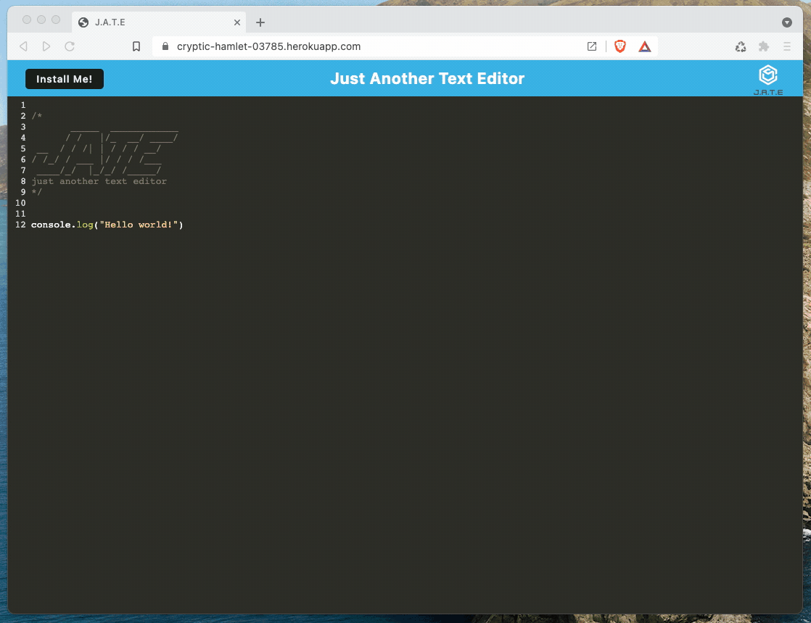
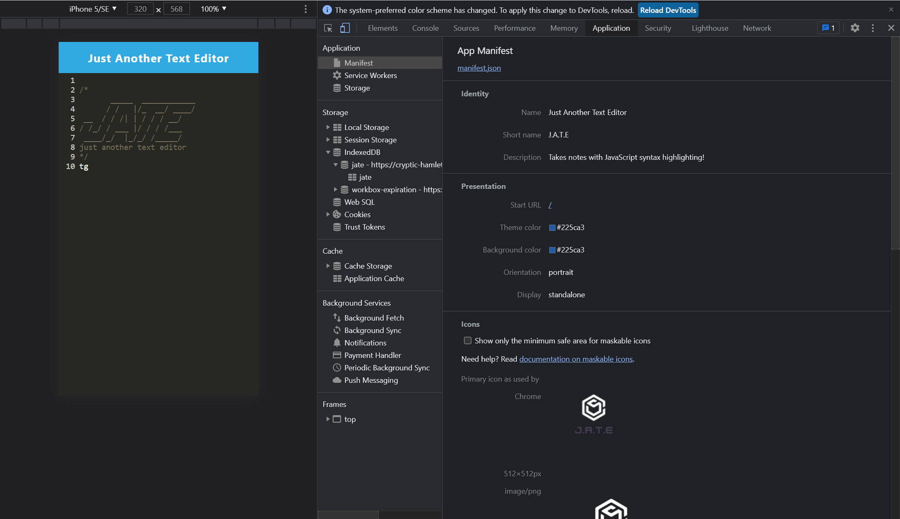
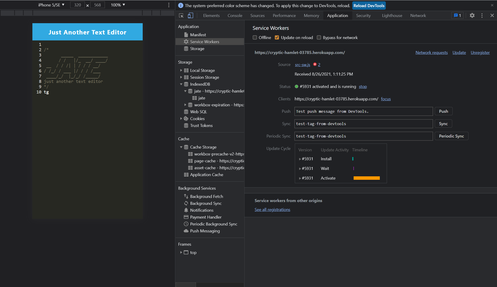
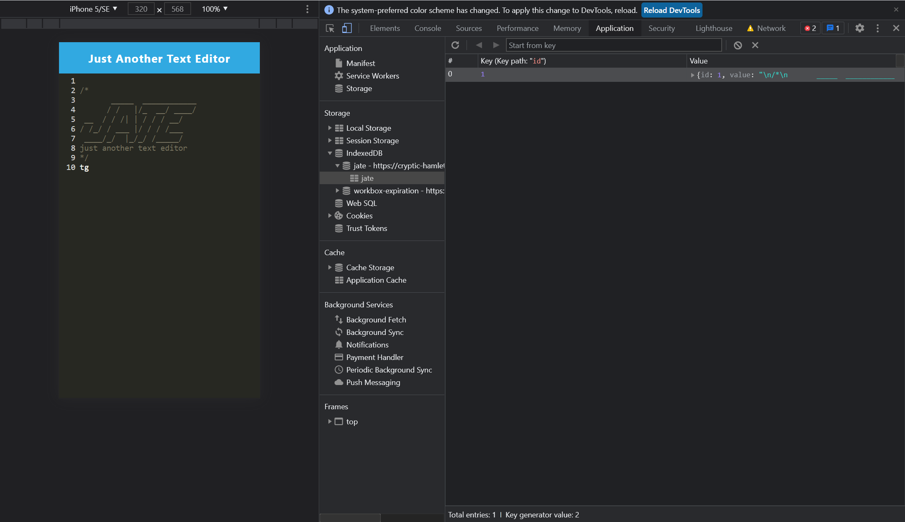

# User Story

## As a Developer
I want to create notes or code snippets with or without an internet connection so that I can reliably retrieve them for later use.

## Acceptance Criteria
**Given** a text editor web application

1. **When** I open my application in my editor
   - **Then** I should see a client server folder structure

2. **When** I run `npm run start` from the root directory
   - **Then** I find that my application should start up the backend and serve the client

3. **When** I run the text editor application from my terminal
   - **Then** I find that my JavaScript files have been bundled using webpack

4. **When** I run my webpack plugins
   - **Then** I find that I have a generated HTML file, service worker, and a manifest file

5. **When** I use next-gen JavaScript in my application
   - **Then** I find that the text editor still functions in the browser without errors

6. **When** I open the text editor
   - **Then** I find that IndexedDB has immediately created a database storage

7. **When** I enter content and subsequently click off of the DOM window
   - **Then** I find that the content in the text editor has been saved with IndexedDB

8. **When** I reopen the text editor after closing it
   - **Then** I find that the content in the text editor has been retrieved from our IndexedDB

9. **When** I click on the Install button
   - **Then** I download my web application as an icon on my desktop

10. **When** I load my web application
    - **Then** I should have a registered service worker using workbox

11. **When** I register a service worker
    - **Then** I should have my static assets pre-cached upon loading along with subsequent pages and static assets

12. **When** I deploy to Render
    - **Then** I should have proper build scripts for a webpack application

## Mock-Up
The following animation demonstrates the application functionality:

Demonstration of the finished Module 19 Challenge being used in the browser and then installed.

The following image shows the application's manifest.json file:

Demonstration of the finished Module 19 Challenge with a manifest file in the browser.

The following image shows the application's registered service worker:

Demonstration of the finished Module 19 Challenge with a registered service worker in the browser.

The following image shows the application's IndexedDB storage:

Demonstration of the finished Module 19 Challenge with a IndexedDB storage named 'jate' in the browser.

Grading Requirements
